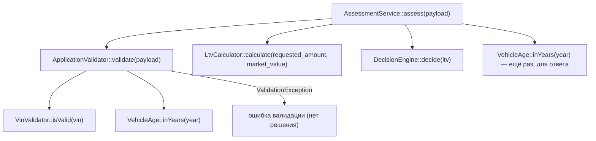

# Карта кода: как считается решение approve / review / reject

Все ссылки — на `backend/` и `backend/config/rules.php`. Актуально на 2026-09-28.

## Участвующие файлы и порядок вызова

Поток: `AssessmentService::assess()` — оркестратор, остальные вызываются из него.

Пошагово:

1. `backend/src/Domain/AssessmentService.php` — `assess(array $payload)`:
   - `$this->validator->validate($payload)` → нормализованный `$input` (vin, year, mileage, market_value, requested_amount, term_months) либо `ValidationException`;
   - `$this->ltvCalculator->calculate($input['requested_amount'], $input['market_value'])` → LTV в процентах, округление до 2 знаков (`round(сумма / стоимость * 100, 2)`);
   - `$this->decisionEngine->decide($ltv)` → строка `approve` / `review` / `reject`;
   - сборка ответа: `vehicle_age` (через `VehicleAge::inYears`), `ltv`, `decision`, `approved_limit` (равен запрошенной сумме при approve, иначе 0).
2. `backend/src/Domain/ApplicationValidator.php` — `validate()` проверяет VIN (через `VinValidator::isValid`), год (`min_year` 1990, не из будущего, `max_age_years` 20), пробег, стоимость > 0, сумму и срок — все пороги из `backend/config/rules.php`. При любой ошибке — `ValidationException`, до расчёта решения дело не доходит.
3. `backend/src/Domain/LtvCalculator.php` — `calculate()`, чистая формула.
4. `backend/src/Domain/DecisionEngine.php` — `decide(float $ltv)`:
   - `ltv < 60.0` (`approve_max`) → `approve`;
   - `60.0 < ltv <= 85.0` (`review_max`) → `review`;
   - `ltv > 85.0` → `reject`.
5. `backend/src/Domain/VehicleAge.php`, `VinValidator.php`, `ValidationException.php` — вспомогательные.

## Куда встанет правило «пробег > 400 000 км → review»

Решение принимает только `DecisionEngine::decide()` — но сейчас он принимает один аргумент `float $ltv` и ничего не знает ни о пробеге, ни о заявке в целом.

- Функция: `DecisionEngine::decide()` — расширить сигнатуру (например, передавать пробег или весь `$input`) и перед reject-веткой по LTV добавить проверку: пробег > порога → `review`. Либо альтернативно добавить проверку в `AssessmentService::assess()` после `$this->decisionEngine->decide($ltv)` — downgrade решения на `review` при превышении пробега. Правильнее по структуре проекта — в `DecisionEngine`, т.к. это «правило решения», а не валидация.
- Порог 400 000 по конвенции проекта не хардкодится, а добавляется в `backend/config/rules.php` (например, отдельный ключ рядом с `vehicle` или новый блок).

Что уже есть:

- значение пробега как входное данное: `ApplicationValidator::validate()` нормализует и возвращает `$input['mileage']` (int), оно попадает в `assess()` в массиве `$input` и возвращается наружу в `input`;
- место в конфиге: секция `rules.php` → `vehicle`, где уже лежит `max_mileage_km`.

Чего не хватает:

- порога 400 000 как отдельного ключа в `rules.php` — нет (сейчас есть только `max_mileage_km => 500000`, и это валидационный верхний предел, не порог решения);
- механизма передачи пробега (или всей заявки) в `DecisionEngine` — нет: `decide()` принимает только `float $ltv`, про пробег класс не знает ничего;
- правила «пробег → review» и вообще любых не-LTV-правил в решении — нет: `DecisionEngine` сейчас чисто LTV-шный.

## Что уже сейчас проверяется про пробег

Только валидация диапазона в `ApplicationValidator::validate()` (строки 43–46): `mileage` должен быть от 0 до `rules['vehicle']['max_mileage_km']` = 500 000 км; иначе ошибка `ValidationException` и заявка вообще не доходит до расчёта решения. Заявка с пробегом 450 000 пройдёт валидацию (меньше 500 000), но на решение не повлияет — правила «400 000 → review» нет. На LTV и решение пробег сейчас не влияет никак.
